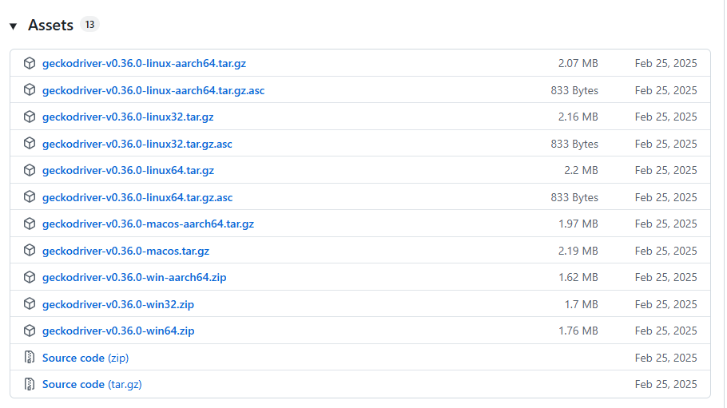

## Selenium Setup

- Selenium is needed for accessing oscar and eforms via browser
- Download the latest gecko driver for firefox from https://github.com/mozilla/geckodriver/releases
  * Scroll down to the Assets section and download zip file.
  
- Add the path to the installed driver to the config file (`..\AI-Scribe\FreeScribe.client\configs\config.yaml`)

