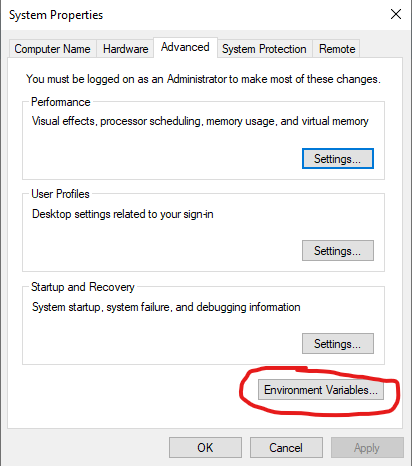
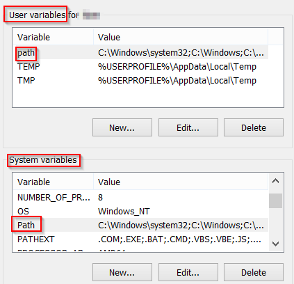
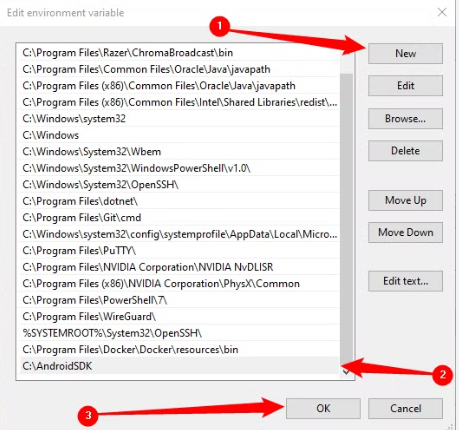

# Tesseract and Poppler Setup

- Tesseract and Poppler are needed for OCRing PDFs
- Download the latest tesseract installer here: **https://github.com/UB-Mannheim/tesseract/wiki**
    - Launch the installer and remember the path where Tesseract is installed (default is `C:\Program Files\Tesseract-OCR`)
- Download the latest Poppler release here : https://github.com/oschwartz10612/poppler-windows/releases/
    - Extract the contents of the zip file and remember the path where you extract it to (usually extract `C:\Program Files\poppler-xx`
- Then you need to add the paths for Tesseract and Poppler to your environment variables.
    - In Windows search, search “environment variables” and click first results, should open something like:
    
    
    
    - Click **Environment Variables**
    - In new window, double click **Path** under **System variables** (or click and then select **Edit**)
    
    
    
    - Then in new window, click **New** (or double click blank spot) to add a new path in environment variables.
    - Add the path to your Tesseract-OCR folder (i.e. if it is installed to `C:\Program Files\Tesseract-OCR` add this path).
    - Add the path to your Poppler bin folder (i.e. if it is installed to `C:\Program Files\poppler-xx\bin` add this path)
    - Then click **OK** and you are done!
    
    